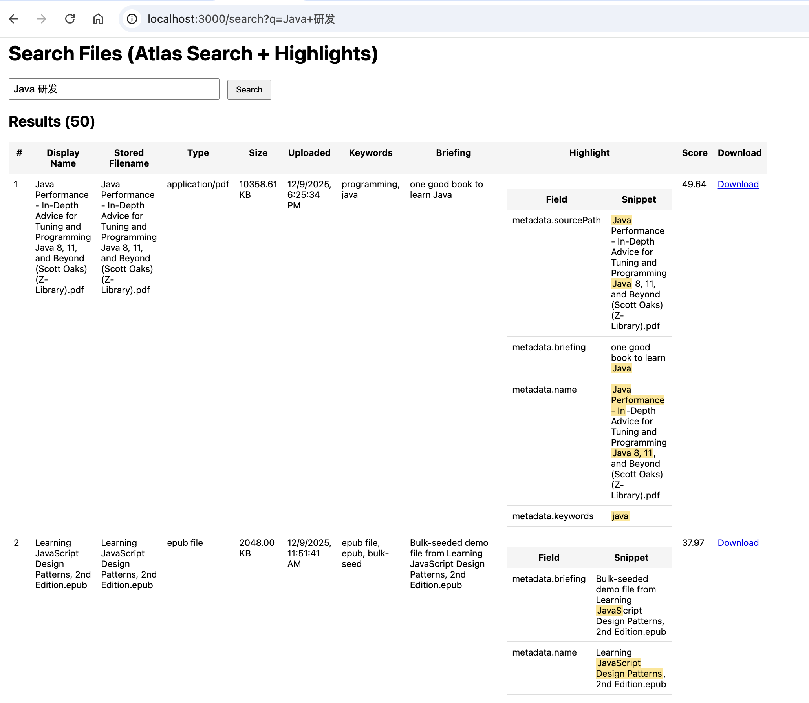

# searchable-fileupload
* NodeJS demo for integrating Express, MongoDB GridFS upload and Metadata search with Atlas Search

## Overview
1. There are two web pages in this project:
   - **Upload page**: http://localhost:3000,  for uploading files
   - **Search page**: http://localhost:3000/search for searching uploaded files by metadata with Atlas Search

2. The uploaded files are stored in MongoDB GridFS.
3. The special suffix files with less than 10MB, including `.docx`, `.json`, `.xml`, are parsed to extract content for content searchable.
 
## Simple webpages
1. Upload and file lists
  
2. Search results with highlight
  
## Quick start
### 0. init the project
```bash
npm init -y
npm install express multer mongodb mammoth

```

### 1. Start the server
```bash
node server.js
```

### 2. Open the browser for upload  


## Full text Search
This simple demo focus on the file metadata search with large files. Also supports samll and simple format's file content full text search with Atlas Search.
### Atlas Search Index
Set up the Atlas Search index with the following JSON definition in Atlas UI
```json
{
  "mappings": {
    "dynamic": false,
    "fields": {
      "filename": {
        "type": "string"
      },
      "metadata": {
        "fields": {
          "briefing": {
            "multi": {
              "gram": {
                "analyzer": "briefing_ngram",
                "type": "string"
              },
              "words": {
                "analyzer": "lucene.smartcn",
                "searchAnalyzer": "lucene.smartcn",
                "type": "string"
              }
            },
            "type": "string"
          },
          "content": {
            "multi": {
              "chinese": {
                "analyzer": "lucene.smartcn",
                "searchAnalyzer": "lucene.smartcn",
                "type": "string"
              },
              "english": {
                "analyzer": "lucene.standard",
                "searchAnalyzer": "lucene.standard",
                "type": "string"
              }
            },
            "type": "string"
          },
          "keywords": {
            "analyzer": "lucene.standard",
            "type": "string"
          },
          "name": [
            {
              "analyzer": "lucene.smartcn",
              "type": "string"
            },
            {
              "maxGrams": 10,
              "minGrams": 4,
              "tokenization": "edgeGram",
              "type": "autocomplete"
            }
          ],
          "sourcePath": {
            "analyzer": "lucene.standard",
            "type": "string"
          },
          "type": {
            "analyzer": "lucene.standard",
            "type": "string"
          }
        },
        "type": "document"
      }
    }
  },
  "analyzers": [
    {
      "charFilters": [],
      "name": "briefing_ngram",
      "tokenFilters": [
        {
          "type": "lowercase"
        }
      ],
      "tokenizer": {
        "maxGram": 10,
        "minGram": 4,
        "type": "nGram"
      }
    }
  ]
}
```

###  Atlas Search Query
* We can search the uploaded files by metadata, and boost the wanted fields' search scores for prioritizing the results. 
```json
[
    {
        $search: {
            index: "default",
            compound: {
            should: [
                {
                autocomplete: {
                    query: q,
                    path: "metadata.name",
                    fuzzy: {
                    maxEdits: 1,
                    prefixLength: 2
                    }
                }
                },
                {
                text: {
                    query: q,
                    path: [
                    "metadata.keywords",
                    "metadata.sourcePath",
                    "metadata.content"
                    ],
                    score: { boost: { value: 2 } },
                    fuzzy: { maxEdits: 1, prefixLength: 2 }
                }
                },
                {
                text: {
                    query: q,
                    path: "metadata.briefing",
                    score: { boost: { value: 2 } },
                    fuzzy: { maxEdits: 1, prefixLength: 2 }
                }
                }
            ],
            minimumShouldMatch: 1
            },
            highlight: {
            path: [
                "metadata.name",
                "metadata.keywords",
                "metadata.briefing",
                "metadata.sourcePath",
                "metadata.content"
            ]
            }
        }
        },
        { $limit: 50 },
        {
        $project: {
            _id: 1,
            filename: 1,
            uploadDate: 1,
            length: 1,
            metadata: 1,
            score: { $meta: "searchScore" },
            highlights: { $meta: "searchHighlights" }
        }
    }
]
```
